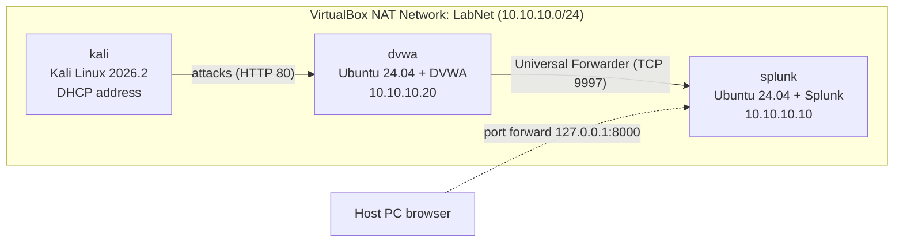

[README.md](https://github.com/user-attachments/files/32918237/README.md)
# VirtualBox Pen Testing and Splunk Lab Guide

| | |
| --- | --- |
| **Purpose** | Build an isolated home lab in Oracle VirtualBox with a Kali Linux attack machine, a vulnerable web application (DVWA), and a Splunk server that collects the web server's logs. |
| **Versions covered** | VirtualBox 7.2.20 · Kali Linux 2026.2 · Ubuntu Server 24.04 LTS · Splunk Enterprise 10.x · DVWA (current `master` branch) |
| **Host requirement** | 64-bit Windows or Linux PC with 16 GB RAM (32 GB recommended), 150 GB free disk, and hardware virtualization (Intel VT-x or AMD-V) enabled in the BIOS/UEFI |

## Lab at a glance

| VM name | Role | Operating system | vCPU | RAM | Disk | IP address |
| --- | --- | --- | --- | --- | --- | --- |
| `kali` | Attack machine | Kali Linux 2026.2 (prebuilt VirtualBox image) | 2 | 4 GB | 80 GB (dynamic) | DHCP |
| `dvwa` | Vulnerable web app | Ubuntu Server 24.04 LTS + DVWA | 1 | 2 GB | 25 GB | 10.10.10.20 |
| `splunk` | Defender / SIEM | Ubuntu Server 24.04 LTS + Splunk Enterprise | 2 | 8 GB | 60 GB | 10.10.10.10 |

The RAM and disk sizes are lab-scale estimates, not vendor minimums. Splunk runs acceptably at this size for one small log source; give it more RAM if searches feel slow.

## Build order

Follow the guides in order. Each one ends with a check that confirms it worked before you move on.

| Step | Guide | Result |
| --- | --- | --- |
| 1 | [Install VirtualBox (Windows and Linux)](docs/01-install-virtualbox.md) | VirtualBox 7.2 running on your host |
| 2 | [Create the NAT Network](docs/02-nat-network.md) | `LabNet` network with DHCP and port forwarding |
| 3 | [Create the Kali Linux attack machine](docs/03-kali-attack-machine.md) | Updated Kali VM on `LabNet` |
| 4 | [Build the Ubuntu base VMs](docs/04-ubuntu-base-vms.md) | Two Ubuntu Server VMs with static IP addresses |
| 5 | [Install DVWA (vulnerable web app)](docs/05-dvwa-vulnerable-web-app.md) | DVWA reachable from Kali |
| 6 | [Set up Splunk](docs/06-splunk-setup.md) | Splunk server receiving DVWA web logs |
| 7 | [Attack and detect](docs/07-attack-and-detect.md) | First attacks from Kali visible in Splunk |

## Safety rules

1. **Never expose DVWA to the internet or your home network.** DVWA's own documentation warns that any internet-facing copy will be compromised. The port forwarding rules in this guide bind to `127.0.0.1` so only your host PC can reach the lab.
2. **Attack only machines you own.** Keep every scan and exploit inside `LabNet`.
3. **Take snapshots.** Snapshot each VM after it passes its check so you can roll back after an exercise.
4. **Keep this lab separate from work.** Do not use employer systems, credentials, or data in the lab.

## Glossary

| Term | Meaning |
| --- | --- |
| DVWA | Damn Vulnerable Web Application, a deliberately insecure PHP/MySQL app for practicing web attacks |
| NAT Network | A VirtualBox network mode where VMs share a private subnet, can reach each other, and share the host's internet connection |
| SIEM | Security Information and Event Management, a tool that collects and searches security logs (Splunk in this lab) |
| Universal Forwarder (UF) | Splunk's lightweight agent that ships log files to a Splunk server |
| Snapshot | A saved point-in-time copy of a VM's state that you can restore |

## Sources

See each guide's **Sources** section for the official documentation behind its steps.
